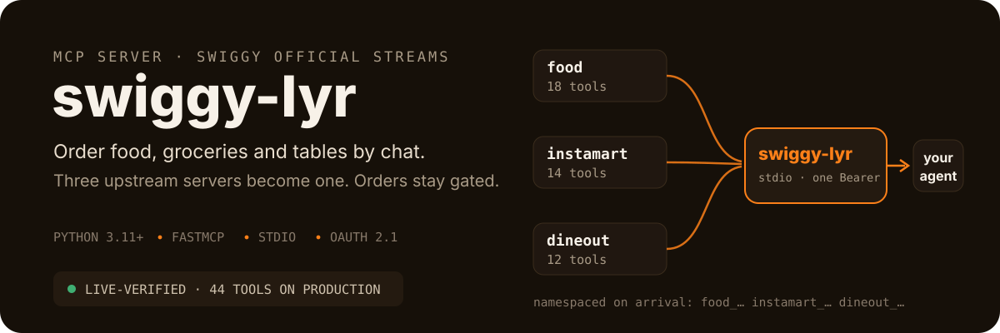
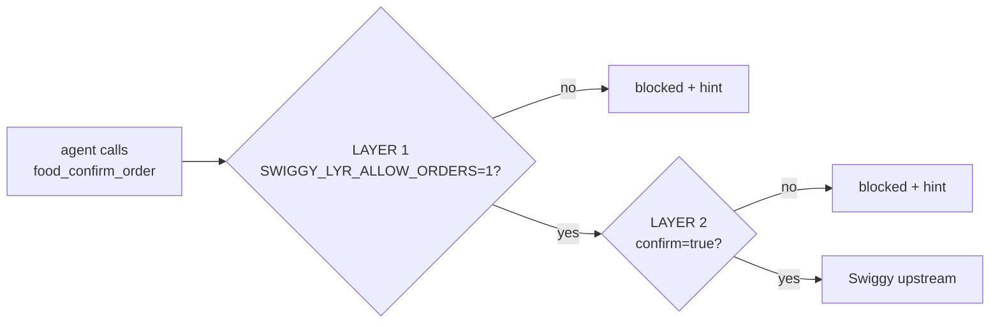

<p align="center">
  
</p>

<h1 align="center">swiggy-lyr</h1>

<p align="center">
  <a href="#order-safety"></a>
  
  
  
  
</p>

---

Swiggy ships three separate official MCP servers — Food delivery, Instamart groceries, Dineout reservations. Each needs its own connection, and nothing stands between an agent and a one-tap COD order that **cannot be cancelled**.

**swiggy-lyr** is a local stdio server that proxies all three into one. Your agent config lists a single entry; every tool arrives namespaced (`food_`, `instamart_`, `dineout_`); one OAuth token covers everything; and ordering is blocked behind two explicit safety layers.

> **[08/2026] Live on production:** OAuth consent round-trip completed · 44 upstream tools discovered across all three streams · real search chain executed (`get_addresses` → `search_restaurants` returned live restaurant data) · all four high-risk tools verified to block without confirmation.

## The three streams

| Stream | Tools | What your agent can do |
|---|---|---|
| **Food** | 18 | Search restaurants & menus, build carts, apply coupons, place & track orders |
| **Instamart** | 14 | Search grocery products, manage "go-to" items, checkout, track deliveries |
| **Dineout** | 12 | Discover venues, check slots, book tables, follow booking status |

Tool schemas are pulled from the upstream servers at startup — when Swiggy changes their stack, swiggy-lyr follows without a code change here.

## Order safety

COD orders placed through Swiggy cannot be cancelled. So mutating tools are off unless *you* switch them on — twice.



<details>
<summary>Which of the 44 tools are gated?</summary>

**Layer 1 only** (env required): cart updates/clears, `create_cart`, `apply_food_coupon`
**Both layers** (env **and** `confirm=true`): `*_confirm_order`, `instamart_checkout`, `food_place_food_order`, `dineout_book_table`

Everything else — search, menus, addresses, slots, order history — always works.
</details>

## Quick start

**Fresh machine, one command** (bootstraps `uv` if missing — `uv` then provisions Python itself):

```bash
curl -sSL https://raw.githubusercontent.com/ishan-parihar/swiggy-lyr/main/install.sh | bash
```

Already have `uv`? The direct equivalent:

```bash
uv tool install git+https://github.com/ishan-parihar/swiggy-lyr.git
```

Then authenticate and verify:

```bash
swiggy-lyr --login      # one-time browser consent (~5 day token)
swiggy-lyr --status
```

> **PyPI:** once the repo is configured as a trusted publisher on PyPI, pushing a `v*` tag publishes the package and `uv tool install swiggy-lyr` becomes the shortest path. The workflows are already in place (`.github/workflows/publish.yml`).

Upgrade / reinstall / remove:

```bash
uv tool upgrade swiggy-lyr          # pull latest main
uv tool install --force --reinstall git+https://github.com/ishan-parihar/swiggy-lyr.git
uv tool uninstall swiggy-lyr
```

Point your agent at it:

```json
{
  "mcpServers": {
    "swiggy": { "command": "swiggy-lyr", "args": [] }
  }
}
```

First conversation ideas:

> *"What did I order from Swiggy food this week?"* → `food_get_food_orders`
> *"Find me a highly rated dosa place near home under ₹200 for two."* → `food_search_restaurants`
> *"Add oats, milk and bananas to my Instamart cart."* → `instamart_update_cart` *(gated)*

## How it works

```
your agent ⇄ stdio FastMCP ⇄ dynamic proxy ⇄ mcp.swiggy.com/{food, im, dineout}
                                   │
                    tools/list at startup → typed local wrappers
                    401 → silent refresh (when Swiggy issues refresh tokens)
                    401 without refresh → re-login hint, never a crash
```

No scraping, no cookies, no reverse-engineered endpoints — just Swiggy's official OAuth 2.1 + PKCE flow against their published MCP servers, discovered via RFC 9728 metadata.

## CLI reference

| Command | Does |
|---|---|
| `swiggy-lyr` | Start the MCP server on stdio |
| `swiggy-lyr --login` | Browser consent flow (OAuth 2.1 + PKCE) |
| `swiggy-lyr --login --token BEARER` | Store a token manually instead |
| `swiggy-lyr --status` | Auth state, expiry countdown, token path |
| `swiggy-lyr --transport http --port 8000` | Serve over HTTP instead of stdio |

| Environment variable | Purpose |
|---|---|
| `SWIGGY_LYR_ALLOW_ORDERS` | Layer 1 of the gate — enables mutating tools |
| `SWIGGY_LYR_TOKEN` | Bypass stored token (CI, manual) |
| `SWIGGY_LYR_CLIENT_ID` | Pre-registered OAuth client if DCR changes |
| `SWIGGY_REDIRECT_URI` | Override callback URI |

## Honest limits

- Tokens last ~5 days; Swiggy currently returns no refresh token, so expiry means one browser click (`--login`). The code auto-refreshes silently if they start issuing them.
- Keep the Swaggy app closed while an agent works — Swiggy warns about session conflicts.
- Ordering supports COD only (Swiggy's own limitation), which is exactly why layer 2 exists.
- Third-party development sits inside Swiggy's security-review window — treat this as personal-use tooling.
- `get_orders` history has known staleness quirks in Swiggy's upstream ([#36](https://github.com/Swiggy/swiggy-mcp-server-manifest/issues/36)).

## Development

```bash
uv sync && uv run pytest -q   # 173 tests, zero network
uv run ruff check .
uv run python tests/live_verify.py   # production verification (needs --login first)
```

Pushing to `main` is the release. See [AGENTS.md](AGENTS.md) for conventions.

## License

MIT
